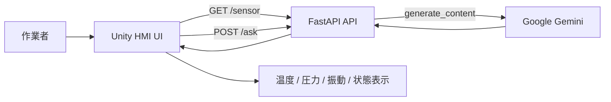

# FactoryAIAssistant 技術仕様書

## 1. 概要

本リポジトリは、工場内の設備監視と作業支援を目的としたHMI（Human Machine Interface）システムのプロトタイプです。

主な構成は次の2層です。

- UnityベースのHMIクライアント
- FastAPIベースのAI応答・センサAPI

Unity側は設備の状態表示と作業者からの質問入力を担い、バックエンドのAPIへアクセスしてセンサ値の取得とAI応答の受け取りを行います。AI側はGoogle Geminiを利用して、工場作業者向けの簡潔で実用的な日本語回答を返します。

## 2. 目的とスコープ

### 2.1 目的

- 工場設備の状態を可視化する
- 作業者が設備に関する簡単な質問を入力できる
- AIアシスタントが短時間で判断材料を返す
- モックセンサ値とUIデモを通じて、現場向けHMIの動作検証を行う

### 2.2 対象範囲

- リアルタイムのセンサ値表示
- AIチャット形式の質問応答
- ローカル開発環境でのAPI連携
- Unityエディタでのプレイモードテスト

## 3. システム構成



## 4. ディレクトリ構成

- `FactoryAIAssistant/` : Unityプロジェクト本体
- `factory-hmi-api/` : Python APIサーバー
- `README.md` : 全体設計の概要

## 5. 技術スタック

- Unity 6000系
- C# と UnityWebRequest
- FastAPI
- Pydantic
- Python-dotenv
- Google Generative AI SDK
- pytest

## 6. 主要機能

### 6.1 センサ可視化

HMI側で定期的に `/sensor` を呼び、以下の値を表示します。

- 温度
- 圧力
- 振動
- 状態（normal / warning）

### 6.2 AI質問応答

HMI側の入力欄で作業者が質問を入力すると、`/ask` にJSONで送信され、バックエンドがGeminiへ問い合わせます。

応答は以下の方針で生成されます。

- 日本語で簡潔に回答する
- 3行以内で返す
- 工場設備の専門家として説明する
- 専門用語はわかりやすく表現する

### 6.3 UI再現性

Unityプロジェクトには工場のような見た目を持つ3Dシーンと、会話UIが含まれており、HMIのプロトタイプとして可視化されています。

## 7. 通信仕様

### 7.1 GET /sensor

センサ値のサンプルを返します。

レスポンス例:

```json
{
  "temperature": 72.4,
  "pressure": 2.13,
  "vibration": 0.45,
  "status": "normal"
}
```

### 7.2 POST /ask

ユーザーの質問文をJSONで受け取り、AIの回答を返します。

リクエスト例:

```json
{
  "message": "圧力が上がっている原因を教えてください。"
}
```

レスポンス例:

```json
{
  "answer": "圧力上昇の主な要因は流量増加や詰まりです。確認ポイントはフィルタと弁の状態です。"
}
```

## 8. 運用時の制約

- `GEMINI_API_KEY` が設定されていない場合、Gemini APIの呼び出しが失敗する可能性があります。
- 現在の実装ではセンサ値がランダム生成であり、現実の設備データではありません。
- FastAPIサーバーはローカル開発用途を前提としています。
- Unity側は `http://localhost:8000` を前提に通信しています。

## 9. 開発・テスト

- APIテスト: `factory-hmi-api/test_main.py`
- Unityテスト: `FactoryAIAssistant/Assets/Tests/PlayMode/Tests`

主要な確認観点:

- `/` が正常に応答するか
- `/sensor` がJSON形式で返るか
- `/ask` がAI依存のモック応答で正しく動作するか
- Unity側がセンサ値とAI応答をUIへ表示できるか

## 10. 参照ドキュメント

- [Unityクライアント仕様書](./FactoryAIAssistant/README.md)
- [FastAPI仕様書](./factory-hmi-api/README.md)

## 11. 今後の改善候補

- センサ値を実設備またはMQTT/WebSocket経由の実データに切り替える
- AI応答の履歴管理と会話コンテキスト保持
- 認証やアクセス制御の導入
- 監視ダッシュボードとアラート機能の強化
- 本番環境向けのログ、監視、バックアップ設計

以上が本リポジトリの全体技術仕様の概要です。詳細設計は各モジュールのREADMEを参照してください。
