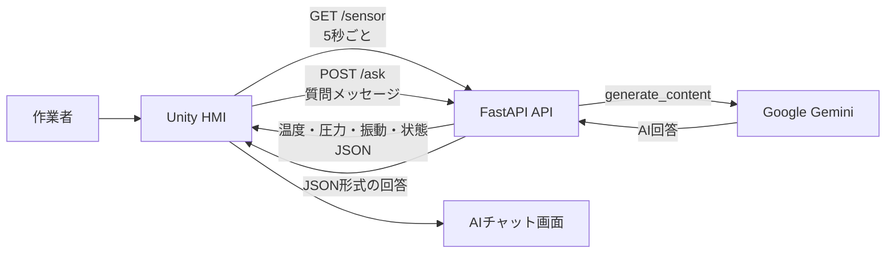
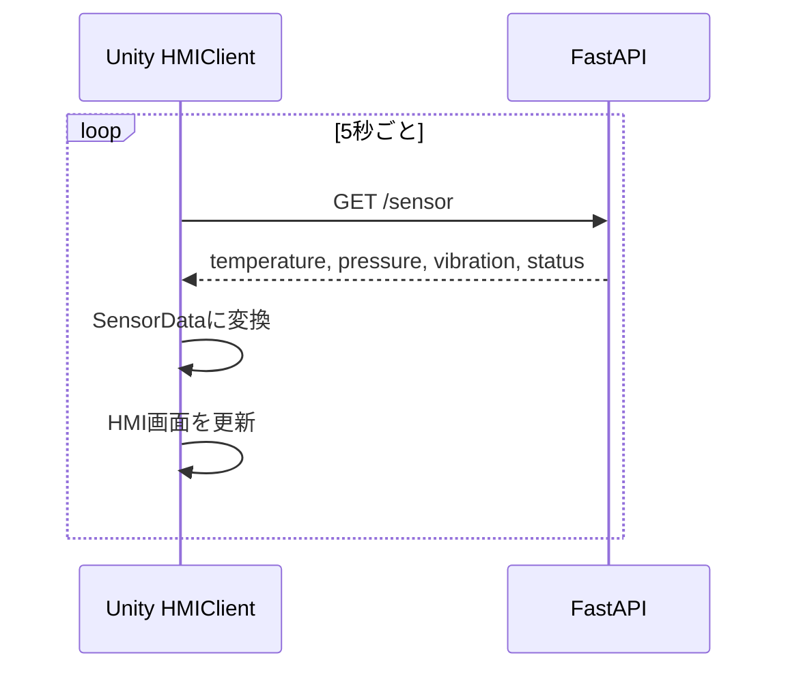
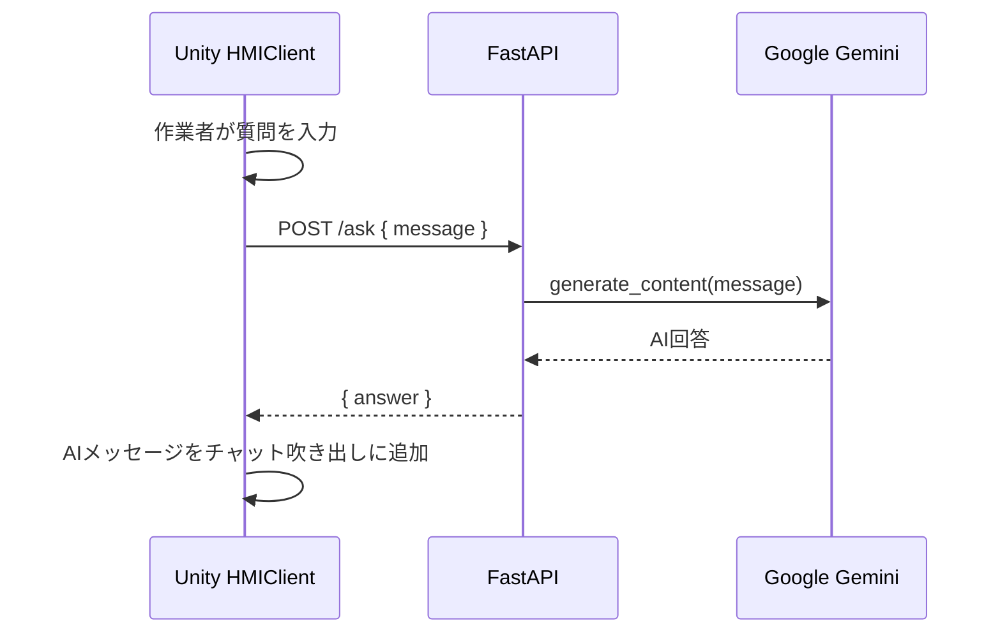

# API通信フロー図

FactoryAIAssistantでは、UnityのHMIクライアントがFastAPIサーバーへアクセスします。

## 全体の通信フロー



## センサ値取得の流れ



`/sensor` のセンサ値は、現在は実際の設備から取得していません。FastAPIがランダムに生成する動作確認用のモックデータです。

## AI質問応答の流れ



## APIのデータ形式

### `GET /sensor`

レスポンス例:

```json
{
  "temperature": 72.4,
  "pressure": 2.13,
  "vibration": 0.45,
  "status": "normal"
}
```

### `POST /ask`

リクエスト例:

```json
{
  "message": "温度が高い理由を教えてください。"
}
```

レスポンス例:

```json
{
  "answer": "温度上昇の主な原因は負荷増加や換気不良です。確認ポイントは送風と保守状態です。"
}
```
