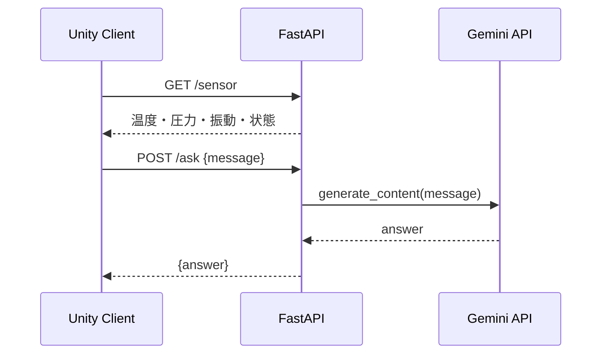

# factory-hmi-api 技術仕様書

## 1. 概要

本モジュールは、工場監視用HMIのAIアシスタント機能を提供するFastAPIベースのバックエンドです。

主な役割は以下の通りです。

- センサ値のモック生成
- ユーザー質問の受付
- Gemini APIへの問い合わせ
- JSON形式でのHMIへの応答

本APIは、Unityクライアントから `localhost:8000` に対してアクセスされることを想定しています。

## 2. 対象範囲

- `/` のヘルス確認
- `/sensor` のセンサ値取得
- `/ask` の質問応答
- Gemini API統合
- CORS設定
- pytestによる検証

## 3. システム概要

本APIはFastAPIで構成され、以下の構成で動作します。

- Web API層: FastAPI
- モデル層: Google Gemini
- ステータス管理: センサ状態のランダム生成
- 通信方式: JSON over HTTP



## 4. 技術スタック

- Python 3.11系または互換環境
- FastAPI
- Pydantic
- python-dotenv
- google-generativeai
- pytest
- Uvicorn

## 5. 依存関係と設定

### 5.1 必須環境変数

`.env` または `.env.example` に以下を記載します。

```env
GEMINI_API_KEY=your_api_key_here
```

`load_dotenv()` により、起動時に環境変数が読み込まれます。

### 5.2 依存関係のインストール

```bash
pip install fastapi uvicorn python-dotenv google-generativeai pytest
```

## 6. API設計

### 6.1 GET /

ヘルス確認用のエンドポイントです。

レスポンス:

```json
{"message": "Welcome to the Factory HMI API"}
```

### 6.2 GET /sensor

センサ値を返します。実装上はランダム値を生成します。

レスポンス形式:

```json
{
  "temperature": 72.4,
  "pressure": 2.13,
  "vibration": 0.45,
  "status": "normal"
}
```

項目説明:

- `temperature`: 温度（℃）
- `pressure`: 圧力（MPa）
- `vibration`: 振動（mm/s）
- `status`: `normal` または `warning`

### 6.3 POST /ask

ユーザーの質問文字列を受け取り、Geminiに問い合わせて回答を返します。

リクエスト形式:

```json
{
  "message": "温度が高い理由を教えてください。"
}
```

レスポンス形式:

```json
{
  "answer": "温度上昇の主な原因は負荷増加や換気不良です。確認ポイントは送風と保守状態です。"
}
```

### 6.4 System Prompt

Geminiのシステムインストラクションでは、以下の方針を設定しています。

- 工場設備の専門家として回答する
- 日本語で簡潔に答える
- 3行以内で表現する
- 専門用語はやさしく説明する

## 7. 実装詳細

### 7.1 appの初期化

`FastAPI()` を作成し、CORS設定を追加しています。

```python
app = FastAPI()
app.add_middleware(
    CORSMiddleware,
    allow_origins=["*"],
    allow_methods=["*"],
    allow_headers=["*"],
)
```

これにより、Unityのローカル開発環境からのアクセスが容易になります。

### 7.2 Geminiモデル

```python
model = genai.GenerativeModel(
    "gemini-3.1-flash-lite",
    system_instruction=SYSTEM_PROMPT,
)
```

- `gemini-3.1-flash-lite` を利用して高速な応答を実現する
- 返答の品質を一定に保つため、system instructionを設置する

### 7.3 データモデル

`Question` はPydanticモデルで定義されており、以下を受け取ります。

```python
class Question(BaseModel):
    message: str
```

## 8. エラーハンドリング

現時点の実装では、以下のような前提で動作します。

- APIキー欠落時はGemini呼び出しが失敗する可能性がある
- 例外発生時はFastAPIの標準例外処理に依存する
- Unityクライアント側でエラー表示を行う前提とする

今後は以下の改善が考えられます。

- エラーコードの明示
- ログ出力の標準化
- リトライ戦略の導入
- 時間制限や入力長制限の追加

## 9. テスト戦略

`test_main.py` では `TestClient` を使って主要エンドポイントを検証しています。

テスト項目:

- `/` が200を返す
- `/sensor` が必要なキーを含む
- `/sensor` の `status` が `normal` または `warning` である
- `/ask` がJSONの `answer` を返す
- 空メッセージや長文メッセージでも失敗しない

## 10. 実行方法

### 10.1 開発サーバー起動

```bash
cd factory-hmi-api
python main.py
```

または、FastAPIの開発サーバーとして:

```bash
uvicorn main:app --host 0.0.0.0 --port 8000 --reload
```

### 10.2 テスト実行

```bash
cd factory-hmi-api
pytest -q
```

## 11. 制約と想定

- 現状の `/sensor` はランダム値なので、本番データを扱うには置き換えが必要
- APIアクセスはローカルネットワーク前提
- AI回答のトーンは工場作業者向けに簡潔に設計されている
- セキュアな運用のためには認証・監査ログ・アクセス制限が必要

# 初めて実行する方へ

このフォルダーは、Unityから呼び出すFastAPIサーバーです。以下の手順で仮想環境を作成し、依存パッケージをインストールしてから起動します。

## Windows PowerShellでのセットアップ

リポジトリのルートで実行してください。

```powershell
cd factory-hmi-api
python -m venv .venv
.\.venv\Scripts\Activate.ps1
python -m pip install --upgrade pip
python -m pip install -r requirements.txt
```

PowerShellでスクリプト実行が制限されている場合は、一度だけ次を実行します。

```powershell
Set-ExecutionPolicy -Scope CurrentUser RemoteSigned
```

macOS/Linuxの場合は次を実行します。

```bash
cd factory-hmi-api
python3 -m venv .venv
source .venv/bin/activate
python -m pip install --upgrade pip
python -m pip install -r requirements.txt
```

## APIキーの設定と起動

`.env.example` を `.env` にコピーし、`GEMINI_API_KEY` にGoogle AI StudioのAPIキーを設定します。`.env` はGitにコミットしないでください。

仮想環境を有効にした状態で、次のコマンドを実行します。

```bash
python -m uvicorn main:app --host 0.0.0.0 --port 8000
```

ブラウザーで <http://localhost:8000/> を開いてJSONが表示されれば成功です。停止するときは `Ctrl+C` を押します。